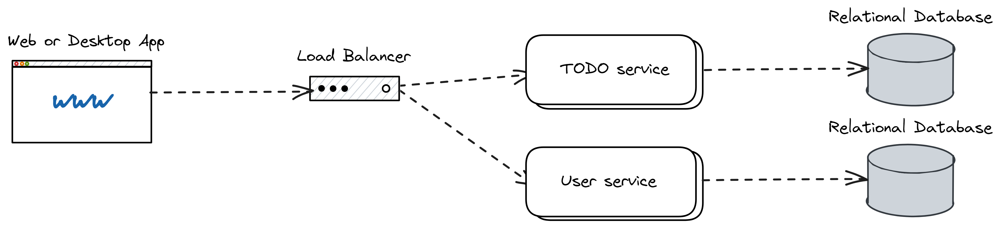

# System Design TODO app

O app Todo, tem um recurso central que o usuário poder criar, modificar e eventualmente concluir tarefas.

## Requirements Engineering

Nessa etapa identificamos quais são os requisitos funcionais e não funcionais, além de dados
de escala do sistema.

### Functional Requirements

### Core Features

- O usuário pode criar uma tarefa
- O usuário pode modificar uma tarefa
- O usuário pode concluir uma tarefa

### Support Features

- As tarefas são privadas para todos os usuários
- Cada tarefa deve ter um título, descrição e data de expiração
- As tarefas podem ser exibidas em lista, que pode ser classificadas pelos metadados como título ou data de expiração

### Non-Functional Requirements

- O app deve possuir baixa latência
- O app deve possuir alta disponibilidade
- O app deve ser escalável

### Scale of the System

- 20k usuários ativos por dia (DAU)
- Cada usuário cria 5 tarefas por dia
- Cada tarefa tem o tamanho de 20kb
- O Ratio de leitura/escrita é 5:1

## Capacity Estimation

Nessa etapa estimamos a capacidade que o sistema precisa, baseado em (Scale of the System) para lidar com sua base de usuários e normalmente são utilizados: Largura de banda e armazenamento.

### Calculate Requests

Dado:

- 20k de usuários ativos por dia (DAU)
- Cada usuário gera, 5 tarefas por dia
- Cada tarefa tem o tamanho de 20kb
- O Ratio de leitura/escrita é 5:1

Estimativa:

- Request: 1 RPS(write) e 5 RPS(read)
- Largura de banda: 120kb/seg

### Calculate storage

Dado:

- 20k de usuários ativos por dia (DAU)
- Cada usuário gera, 5 tarefas por dia
- Cada tarefa tem o tamanho de 20kb

Estimativa:

- Storage: 20kb/seg, 4000 GB em 5 anos

## Data Modeling

### Entities

- User
- Todo

### Attributes

- Todo
  - Título
  - Descrição
  - Data de expiração
- User
  - Email
  - Senha

## Relations

- User CRIA Todo items
- User MODIFICA Todo items
- User FINALIZA Todo items

```txt
Table User {
  id integer [primary key, ref: < Todo.id_user]
  email varchar
  password varchar
}

Table Todo {
  id integer [primary key]
  id_user integer
  title varchar
  description varchar
  dueDate datetime
}
```

## System Design


