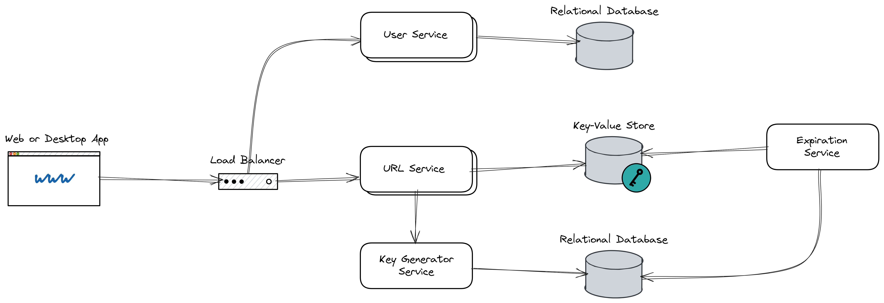

# System Design URL Shortener app

A aplicação tem como recurso central encurtar links e redirecionar o usuário para o link original.

## Requirements Engineering

Nessa etapa identificamos quais são os requisitos funcionais e não funcionais, além de dados
de escala do sistema.

### Core Features

- O usuário deve poder gerar links curtos e únicos
- O usuário deve poder clicar no link encurtado e ser redirecionado para o link original

### Support Features

- O usuário poderá ver um histórico de links encurtados que foram criados
- Os links encurtados criados devem ser expirados por padrão depois de 5 anos

### Non-Functional Requirements

- A aplicação deve possuir alta disponibilidade
- A aplicação deve ser escalável
- A aplicação deve possuir baixa latência

### Scale of the System

- 100M usuários ativos por dia (DAU)
- 1 click por dia por usuário
- O Ratio de leitura/escrita é 10:1
- O tamanho da requisição é de 200 bytes
- Não há picos de tráfego experado
- Podemos ignorar a replicação dos dados

## Capacity Estimation

Nessa etapa estimamos a capacidade que o sistema precisa, baseado em (Scale of the System)

### Calculate Requests

Dado:

- 100M usuários ativos por dia (DAU)
- 1 click por dia por usuário
- O Ratio de leitura/escrita é 10:1
- O tamanho da requisição é de 200 bytes

Estimativa:

- Request: 100 RPS(write) e 1000 RPS(read)
- Largura de banda: 20kb/seg (write) e 200kb/seg (read)

### Calculate storage

Estimativa:

- Storage: 4 TB em 5 anos

## Data Modeling

### Entities

- User
- Link
- Key Range

### Attributes

- User

  - Id
  - Links

- Link

  - Key
  - URL original
  - Data de expiração

- Key Range
  - Key Range
  - Em uso

## System Design

